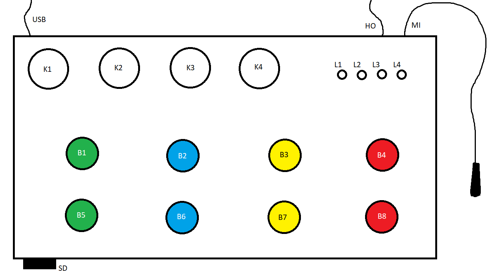

# SpecialEffectSoundBox

A small device which plays sounds in layers and processes voice effects to be mixed and output via a headphone jack.

## Feature layout

* USB: USB port for powering and programming
* MI: Microphone breakout port
* HO: Headphone out port
* SD: SD card slot

* K1: Knob 1

     ( When B8 held down ): Sound Layer 1 Volume
     
     ( When B8 NOT held down ): Voice Pitch
     
* K2: Knob 2

     ( When B8 held down ): Sound Layer 2 Volume
     
     ( When B8 NOT held down ): Voice Reverb Amount
     
* K3: Knob 4

     ( When B8 held down ): Sound Layer 3 Volume
     
     ( When B8 NOT held down ): Voice Delay Amount
     
* K4: Knob 4

     Voice Volume

* L1: LED Mode 1 indicator
* L2: LED Mode 2 indicator
* L3: LED Mode 3 indicator
* L4: LED Mode 4 indicator

* B1: Button 1 plays/stops the 1rst sound in Layer 1 
* B2: Button 2 plays/stops the 1rst sound in Layer 2
* B3: Button 3 plays/stops the 1rst sound in Layer 3
* B4: Button 4 changes mode, every mode uses a new set of sounds 

     ( hold B4 and B8 together to save settings to config defaults. )
     
* B5: Button 5 plays/stops the 2nd sound in Layer 1
* B6: Button 6 plays/stops the 2nd sound in Layer 2
* B7: Button 7 plays/stops the 2nd sound in Layer 3
* B8: Stops all sounds 

     ( hold to change sound layer volumes ) 
     
     ( hold B4 and B8 together to save settings to config defaults. )

## Instructions for use
When you turn it on, the device will look to the config.ini for defaults, otherwise it will use the preset defaults.

Pressing the mode button ( B4 ) will automatically stop all playing sounds and switch between 1 or 4 modes for new sounds. Each mode works the same but has it's own set of 6 sounds.

The sounds are in groups of 2 ( layers. ) Only one sound per layer can be played at a time, if you play sound 1, then press sound 2, sound 1 will stop playing. This is on purpose, so you can have sounds that don't overlay, like background music. Pressing the same sound twice will play, and then stop it ( if it's still playing. )

The knobs normally will adjust the voice settings, but if you hold the stop all sounds button ( B8 ) the knobs will change the layer volumes instead so you could make layer 1 sounds louder then 2 and 3.

## SD Card file description
The SD Card will store all of the sounds for each mode and the default configuration file in the root, and it must be formatted as fat32 ( use SDCardFormatter for this. )

All Wave files must be 16 bit PCM, 44100 Hz WAV files, mono and stereo ( output is mono. )
The sounds are named like this:
  ModeX_LayerX_SoundX.wav.
There are 4 sets (modes) of 3 layers, 2 sounds per layer. So you will have 24 (4 x 3 x 2) wav files from "Mode1_Layer1_Sound1.wav" to "Mode4_Layer3_Sound2".
Config.init details TBD.

## Todo
* Config Saving
* Config Loading
* Ability to make sounds loop

## Would be nice
* Analog Pins, or serial data out with sound levels for visualization.
* Being able to change all 6 sounds to be in layers manually so oyu could have 6 one shots instead ( 6 layers ) 
